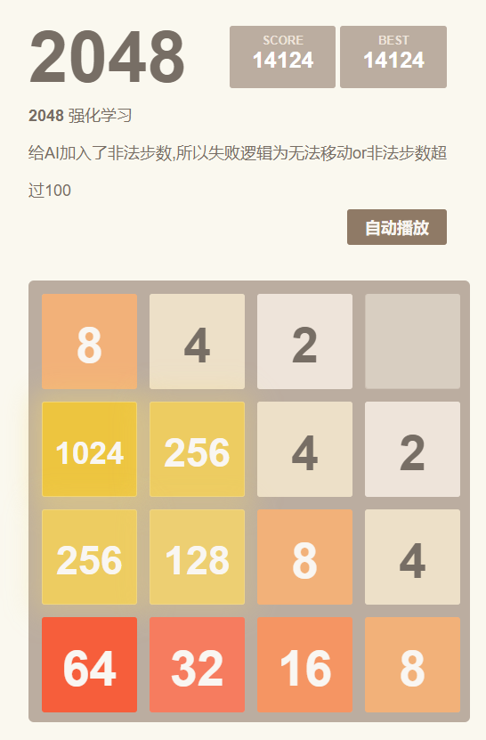
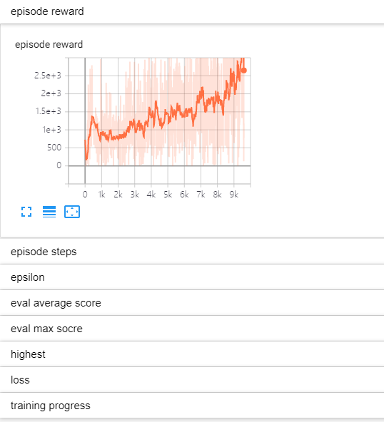

# 2048强化学习
## readme包含项目图片,github须翻墙


#### 软件架构

2048 + 深度学习

#### 安装教程
```
开发环境 win10+pycharm
语言 python 3.7
依赖库：
gym 0.17.3
tensorflow 1.15.0
keras 2.3.1
pytorch 1.6.0
tensorboard 2.0.0
numpy 1.19.2
matplotlib 3.3.2
flask 1.1.2
```
1. 装一下numpy flask
2. 运行文件 app.py
3. 打开网址试玩 http://127.0.0.1:5000/    点击自动播放即可使用目前训练出来分数最高的模型进行自动游戏
4. 项目根目录使用 tensorboard --logdir ./log_tb 查看训练记录

#### 项目说明
1.  项目前端使用vue+bootstrap
2.  游戏逻辑在后台,使用http进行接口交互,python+flask
3.  2048强化学习部分采用DQN算法,利用神经网络生成模型,不断自我学习，pytorch(gpu),如没有配置gpu会自动使用cpu
4.  模型结构 卷积层conv_size = (32, 64) 全连接层 fc_size = (512, 128),根据论文效果，在这个游戏上conv+全连接会相对有更好的效果，因为时间原因没有展开测试

```
一个典型的深度强化学习问题，主要有以下几个基本点：
    . 状态、动作、奖励的设计与表征；
    . 强化学习算法的实现和参数选择；
    . 神经网络的设计和调参；
```

强化学习部分在基本的DQN上做了一些优化
```
1.由于2048的数据是2^n，容易产生梯度爆炸，所以对2048的reward和state奖励采用log2(1+x)/divide进行处理
2.采用DDQN,参考莫凡强化学习代码，
3.采用Priority DQN，用SumTree数据结构作为buffer，根据误差值进行概率采样，即误差越大，梯度越大，被采样概率越大
4.epsilon decay,提高训练效率,即最以eps概率进行随机动作选择，随着训练epoch的增多，eps逐渐降低
```

#### 项目结果
运行100次结果，2次2048最高分,平均9225.68分
```
[512, 512, 512, 1024, 1024, 1024, 1024, 1024, 512, 512, 512, 1024, 256, 2048, 512, 1024, 512, 32, 512, 512, 512, 1024, 512, 1024, 64, 256, 512, 512, 512, 512, 512, 512, 512, 512, 512, 512, 1024, 1024, 1024, 512, 1024, 1024, 512, 256, 128, 512, 128, 1024, 512, 1024, 512, 512, 512, 256, 512, 512, 512, 256, 512, 1024, 512, 1024, 512, 512, 1024, 1024, 512, 1024, 1024, 512, 512, 1024, 256, 512, 512, 512, 512, 1024, 512, 512, 2048, 1024, 1024, 1024, 1024, 512, 1024, 256, 256, 512, 1024, 512, 1024, 512, 256, 512, 1024, 512, 512, 512]
mean score:9225.68, mean highest:646.72
max score:21836.0, max hightest:2048
```
可以看到随着训练的步数增加，游戏的分数一直在稳步增长，但由于项目时间关系，没有继续训练，但通过项目已经有了一些强化学习了解和调参经验



